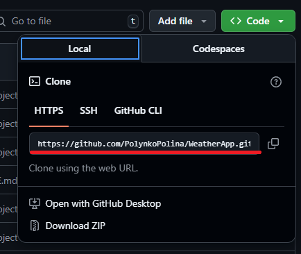
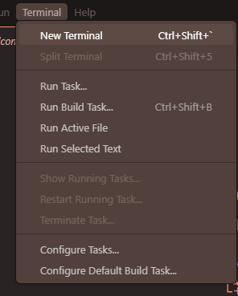
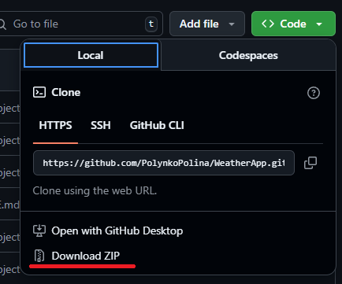
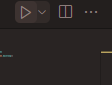

# 🌦WEATHER APPLICATION🌦
---

Цей проект розроблено з метою ознайомлення із роботою API, принципом отримання даних від віддаленого серверу, вмінням їх обробляти, структурувати та застосовувати у своємо проєкті. А саме застосовувалось API такого веб-ресурсу як [OpenWeatherMap](https://openweathermap.org). Проєкт допоможе розібратися із роботою файлів JSON, як правильно отримувати та зберігати дані у файлах з типом .json. Та познайомити користувача з інтерфейсом застосунку розробленим за допомогою пакету [CustomTkinter](https://customtkinter.tomschimansky.com)

---

## 📃Зміст:
- [Основні модулі проєкту](#modules)
- [Розгортання проєкту](#download)
- [Створення віртуального оточення проєкту](#venv)
- [Завантаження модулей до віртуального оточення](#download-venv)
- [Старт проєкту](#start-project)
- [Основні механіки проєкту](#mechanics)
- [Висновок по проєкту](#result)

---

## 🧩Modules:
Всі модулі
1. [customtkinter](https://customtkinter.tomschimansky.com)
2. [json](https://docs.python.org/3/library/json.html)
3. [colorama](https://pypi.org/project/colorama/)
4. [os](https://docs.python.org/uk/3.13/library/os.html)
5. [requests](https://pypi.org/project/requests/)
6. [pillow](https://pypi.org/project/pillow/)
7. [datetime](https://docs.python.org/3/library/datetime.html)

---

## 💻Download:
Завантаження проєкту на ПК
### Git clone:
   - Отримати посилання для клонування проєкту

   

   - Відкрити VSCode --> у Explorer VSCode відкрити папку для збереження склонованого проєкту --> та у Terminal прописати команду: 
   ```
       git clone https://github.com/WorldIT-academy/WeatherApp.git
   ```



   - Відкрити каталог, який ви склонували у Explorer VSCode
    
### Download ZIP
   

---

## 📦Venv:
Створення та активація віртуального оточення
- У Terminal послідовно прописати такі команди:
```
python3 -m venv venv
```
### MAcOS/Linux
   ```
   
   source venv/bin/activate
   ```
### Windows
   ```
   source venv/Scripts/activate
   ```

---

## 📥Download venv:
Завантаження модулів до venv
- У Terminal прописати команду:
```
pip3 install -r requirements.txt
```

---

## ▶️Start project:
Старт проєкту
### Через Terminal:
   - У Terminal написати наступну команду:
   ```
   python3 main.py
   ```
### Через VSCode:
   - Зайти у файл `main.py` --> натиснути кнопку Run Python File у верхньому правому кутку екрана
   

---

## 🛠 Mechanics:
Основні механіки проєкту
- Отримання поточних погодних прогнозів через API OpenWeatherMap
- Введення назви міста, погодні умови якого ви хочете дізнатися
- Виведення інформації у зрозумілому графічному інтерфейсі (GUI)

---

## 📄Result:
Висновок
Проєкт WeatherAPP дав практичний досвід у роботі з:
- HTTP запитами на API
- Графічним інтерфейсом від ідеї до реалізації
- Json файлами та роботі з ними
- Структуруванням проєктів на Python, а в подальшому, на інших мовах програмування